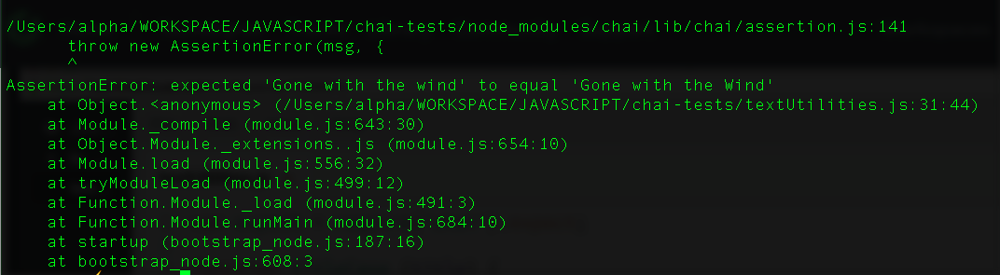
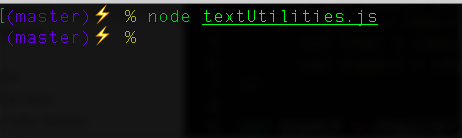

# Javascript Testing with Chai

>Simple Javascript testing Chai.
>Testing to confirm a movie title is formatted in the proper Title Case.


## Dependencies

- Node.js
- Chai

## Setup and Install
- Clone repo
- Install dependencies
- In terminal, move into the chai-tests directory and run tests on  textUtilities.js 
  
```js
node textUtilities.js
```
- Chai will show a waiting prompt if all tests pass or an error message


<p align="center">
 
     <br/>
     Chai throws an assertion error when the movie title is not in the proper title case.
</p>
<p align="center">
 
     <br/>
     Chai shows a waiting console prompt when tests are correct
</p>


## Notes

- Using Behavior Driven Development (BDD) style with the Chai expect method
- Chai is a BDD/TDD assertion library for node and the browser. It can pair with any javascript testing framework. <cite>[ChaiJS.com](http://chaijs.com/)</cite>  
- Writing tests with Chai's expect method


## References

- [Treehouse Tutorial: Part 1: Introducing Unit Testing](https://teamtreehouse.com/library/introduction-72)
- [Treehouse Tutorial: Javascript Unit Testing](https://teamtreehouse.com/library/javascript-unit-testing)
- [Google Testing Blog](https://testing.googleblog.com/)
- [Popular Tests Tools, Languages and Platforms](https://blog.testproject.io/2017/12/13/leading-test-automation-methods/)
- [ChaiJS.com](http://chaijs.com/)
- [Chai Installation Instructions](http://chaijs.com/guide/installation/)
- [Chai Assertion Styles](http://chaijs.com/guide/styles/)
- [Using Title Case](http://grammar-monster.com/lessons/capital_letters_title_case.htm)
- [Steven Anderson Blog: Writing Great Unit Tests](http://blog.stevensanderson.com/2009/08/24/writing-great-unit-tests-best-and-worst-practises/)
- [JavaScript String toUpperCase() Method](http://www.w3schools.com/jsref/jsref_touppercase.asp)
- [JavaScript String substring() Method](http://www.w3schools.com/jsref/jsref_substring.asp)
- [JavaScript String split() Method](http://www.w3schools.com/jsref/jsref_split.asp)
- [JavaScript Array join() Method](http://www.w3schools.com/jsref/jsref_join.asp)
- [Array.prototype.map()](https://developer.mozilla.org/en-US/docs/Web/JavaScript/Reference/Global_Objects/Array/map)

